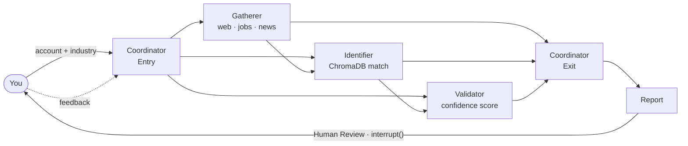

# Enterprise Account Research System — Codebase Architecture

**Last Updated**: 2026-02-26
**Purpose**: Developer reference for context retrieval. For project description and README, see `readme.md`.
**History**: Full session logs archived at `.archive/session_logs_pre_evals.md`

---

## Project Overview

An AI-powered sales intelligence system. Given a target account, seller company, and product catalog,
it gathers intelligence in real time, identifies sales opportunities, and generates actionable reports.

**Stack:** LangGraph · FastAPI · React/TypeScript · ChromaDB · LangSmith · LiteLLM

### How It Works
1. **Coordinator Entry** — validates input, optionally asks clarifying questions
2. **Gatherer** — collects job postings, news, and web signals about the target account
3. **Identifier** — extracts requirements from signals, matches them to seller products via ChromaDB
4. **Validator** — assesses risks, scores confidence, filters opportunities below 0.6 threshold
5. **Coordinator Exit** — generates report, pauses for human review via `interrupt()`
6. **Human Feedback** — user approves or requests changes; workflow resumes from SQLite checkpoint

---

## Current Status

| Item | Status |
|------|--------|
| **Tests** | 454 passing, 0 skipped |
| **Backend** (agents, graph, CLI) | COMPLETE |
| **API Layer** (FastAPI + SSE) | COMPLETE |
| **Frontend** (React + ReactFlow) | COMPLETE |
| **Observability** (LangSmith + node trace panel) | COMPLETE |
| **Web search** | ⚠️ DuckDuckGo intermittent bot detection (see Known Issues) |

---

## Quick Start

**CLI (no UI):**
```bash
.\venv\Scripts\Activate.ps1
python -m src.cli setup-catalog --seller "MathWorks"  # one-time catalog index
python -m src.cli research "Remora Carbon" --industry "carbon capture" --seller "MathWorks"
python -m src.cli resume <thread_id>   # resume paused session
python -m src.cli list-runs            # show all saved sessions
```

**Full stack:**
```powershell
# Terminal 1 — Backend
.\venv\Scripts\Activate.ps1
uvicorn api.main:app --reload --port 8000

# Terminal 2 — Frontend
cd frontend && npm run dev
# → http://localhost:5173

# Optional: LangSmith tracing
$env:LANGCHAIN_TRACING_V2 = "true"
$env:LANGCHAIN_API_KEY = "<key>"
```

**Reliable demo target:** Remora Carbon / carbon capture / MathWorks (web search works reliably for niche companies)

---

## Architecture

### Agent Workflow



### Three-Tier Stack

```
React Frontend    (frontend/)  --  TypeScript, ReactFlow, TanStack Query, Tailwind CSS
                                   http://localhost:5173
        |
        | HTTP REST + SSE
        v
FastAPI API Layer  (api/)      --  REST endpoints, SSE emitter, WorkflowService wrapper
                                   http://localhost:8000
        |
        | Python function calls
        v
LangGraph Agents   (src/)      --  Coordinator, Gatherer, Identifier, Validator
                                   SQLite checkpoints, ChromaDB, DuckDuckGo MCP
```

---

## Agent Responsibilities

### CoordinatorAgent
- **File**: `src/agents/coordinator.py` (~600 lines) | **Tests**: 31
- **Entry Points**: `process_entry()`, `process_exit()`, `process_feedback()`
- **Role**: Orchestrates workflow, handles human-in-loop interrupts, routes feedback
- **Schemas**: `InputValidation`, `ClarificationCheck`, `FeedbackIntent`

### GathererAgent
- **File**: `src/agents/gatherer.py` (~540 lines) | **Tests**: 16
- **Role**: Intelligence collection from DuckDuckGo MCP (web + news) and job boards
- **Outputs**: `signals`, `job_postings`, `news_items`, `tech_stack`
- **Schema**: `SourceAnalysis` (Ollama `response_format`)

### IdentifierAgent
- **File**: `src/agents/identifier.py` (~360 lines) | **Tests**: 31
- **Role**: Extracts requirements from signals, matches to products via semantic search
- **Uses**: `ProductMatcher` (ChromaDB), `ModelRouter`
- **Schemas**: `RequirementsExtraction`, `OpportunitiesGeneration`

### ValidatorAgent
- **File**: `src/agents/validator.py` (~310 lines) | **Tests**: 35
- **Role**: Risk assessment, confidence re-scoring, 0.6 threshold filtering
- **Outputs**: `validated_opportunities`, `competitive_risks`
- **Schemas**: `RiskAssessment`, `OpportunityScoring`

---

## File Inventory

### Phase 1: Core Infrastructure

| File | Lines | Purpose |
|------|-------|---------|
| `src/config.py` | ~150 | Pydantic settings, env vars, model routing config |
| `src/core/exceptions.py` | ~120 | Custom exception hierarchy |
| `src/core/model_router.py` | ~350 | 3-tier LLM routing, caching, retries, Anthropic prompt caching |
| `src/core/base_agent.py` | ~220 | Abstract BaseAgent, StatelessAgent |
| `src/utils/logging.py` | ~80 | Structured logging (structlog) |
| `src/utils/json_parsing.py` | ~150 | Robust JSON extraction from LLM responses |
| `src/models/llm_schemas.py` | ~210 | Pydantic schemas for LLM structured outputs |

### Phase 2: Data Layer

| File | Lines | Purpose |
|------|-------|---------|
| `src/models/state.py` | ~180 | ResearchState TypedDict, Signal, Opportunity |
| `src/models/domain.py` | ~180 | JobPosting, CompanyInfo, Product, AgentResult |
| `src/data_sources/base.py` | ~150 | Abstract DataSource, CachedDataSource |
| `src/data_sources/mcp_ddg_client.py` | ~400 | DuckDuckGo MCP client with rate limiting + semaphore |
| `src/data_sources/scraper.py` | ~250 | Web scraping (BeautifulSoup, httpx) |
| `src/data_sources/job_boards.py` | ~300 | Job board scraping, career page detection |
| `src/data_sources/product_catalog.py` | ~350 | ChromaDB indexing, semantic product matching |
| `src/graph/workflow.py` | ~520 | LangGraph workflow, SQLite checkpointing, HITL interrupt |
| `src/graph/sse_callbacks.py` | — | SSECallbackHandler, node trace store |

### Phase 3: Agents

| File | Lines | Purpose |
|------|-------|---------|
| `src/agents/coordinator.py` | ~580 | Entry/exit/feedback orchestration, human-in-loop |
| `src/agents/gatherer.py` | ~530 | Intelligence collection with LLM analysis |
| `src/agents/identifier.py` | ~350 | Opportunity identification + ProductMatcher |
| `src/agents/validator.py` | ~300 | Confidence scoring, risk assessment |

### Phase 4: CLI

| File | Lines | Purpose |
|------|-------|---------|
| `src/cli/main.py` | ~185 | Argparse CLI entry point (research / resume / list-runs) |
| `src/cli/commands.py` | ~436 | Command implementations, `_run_with_human_loop()` |
| `src/cli/formatters.py` | ~353 | Terminal summary, markdown report, JSON export |

### API Layer

| File | Purpose |
|------|---------|
| `api/main.py` | FastAPI app: CORS, lifespan, router registration |
| `api/routers/research.py` | All `/api/research/*` REST + SSE endpoints |
| `api/services/workflow_service.py` | start / stop / discard / feedback / state / list |
| `api/schemas/api_models.py` | Pydantic request/response models |
| `api/sse/event_stream.py` | SSE emitter + per-thread asyncio.Queue subscribers |

### Tests (454 total)

| File | Tests | Purpose |
|------|-------|---------|
| `tests/test_agents/test_coordinator.py` | 31 | CoordinatorAgent coverage |
| `tests/test_agents/test_gatherer.py` | 16 | GathererAgent coverage |
| `tests/test_agents/test_identifier.py` | 31 | IdentifierAgent coverage |
| `tests/test_agents/test_validator.py` | 35 | ValidatorAgent coverage |
| `tests/test_cli/` (3 files) | 73 | CLI formatters, commands, arg parsing |
| `tests/test_integration/test_pipeline.py` | 13 | Agent pipeline flow (mocked) |
| `tests/test_integration/test_feedback_loops.py` | 16 | Human feedback routing |
| `tests/test_integration/test_error_recovery.py` | 17 | Error handling paths |
| `tests/test_integration/test_checkpointing.py` | 17 | SQLite checkpointing |
| `tests/test_integration/test_realistic_fixtures.py` | 28 | Realistic fixture tests |
| `tests/test_integration/test_e2e_ollama.py` | 21 | E2E with real Ollama (slow) |
| `tests/test_integration/test_e2e_full_workflow.py` | 7 | E2E with real ChromaDB (slow) |
| `tests/test_utils/test_json_parsing.py` | 36 | JSON parsing utility |
| Other (core, router, data sources) | 63 | Infrastructure |

```bash
python -m pytest tests/ -m "not slow"   # fast tests only
python -m pytest tests/ -v               # all 454 tests
```

**Fixtures**: `tests/fixtures/` — `llm_responses/*.json`, `search_results/*.json`, `job_postings/*.json`

---

## ResearchState Schema

```python
# src/models/state.py
class ResearchState(TypedDict):
    # Input (from user)
    account_name: str              # "Boeing"
    industry: str                  # "aerospace"
    seller_name: str               # "MathWorks"
    user_context: str | None       # Sales objective
    research_depth: ResearchDepth  # QUICK / STANDARD / DEEP

    # Gathered data (GathererAgent)
    signals: list[Signal]          # Web search results with LLM analysis
    job_postings: list[dict]       # Scraped job postings
    news_items: list[dict]         # News articles
    tech_stack: list[str]          # Extracted technologies
    company_domain: str | None     # Auto-detected (e.g. "boeing.com")

    # Analysis (IdentifierAgent)
    opportunities: list[Opportunity]     # Matched products with evidence

    # Validation (ValidatorAgent)
    validated_opportunities: list[Opportunity]  # Confidence > 0.6
    competitive_risks: list[str]                # Risks with citations

    # Human interaction (CoordinatorAgent)
    human_feedback: list[str]      # Conversation history
    waiting_for_human: bool        # Workflow paused for user input
    human_question: str | None     # Question / report shown to user
    current_report: str | None     # Formatted markdown report
    feedback_context: str | None   # Parsed guidance for retry
    next_route: str | None         # Routing decision after feedback

    # Workflow control
    progress: ResearchProgress     # Tracks which agents completed
    langsmith_url: str | None      # Trace deep-link (if tracing enabled)
```

---

## Model Router Reference

**File**: `src/core/model_router.py`

| Complexity | Model | Provider | Typical use |
|------------|-------|----------|-------------|
| 1–3 | `llama3.2:3b` | Local Ollama | Coordinator, Gatherer |
| 4–7 | `llama-3.1-8b-instant` | Groq | Identifier, Validator |
| 8–10 | `llama-3.1-70b` | Groq | Complex reasoning |
| opt-in | `claude-haiku-4-5-20251001` | Anthropic | Prompt caching (via `model_override`) |

The `anthropic/` path uses `cache_control` on the system prompt — reduces input token costs ~90%
on cache hits for agents that reuse the same system prompt across many calls.

---

## JSON Parsing Utility

**File**: `src/utils/json_parsing.py`

```python
from src.utils.json_parsing import (
    extract_json_from_llm_response,  # Main — handles markdown-wrapped JSON, extra text
    extract_json_with_default,        # Returns default dict on failure (never raises)
    safe_get_field,                   # Type-checked field extraction
    JSONParseError,                   # Custom exception
)

# Example — LLM often wraps JSON in markdown fences:
response_text = '```json\n{"confidence": 0.85, "summary": "Acme expanding"}\n```'
result = extract_json_from_llm_response(response_text)
# → {"confidence": 0.85, "summary": "Acme expanding"}

confidence = safe_get_field(result, "confidence", 0.0, float)
```

---

## Web UI / API Layer

### API Endpoints

| Endpoint | Method | Description |
|----------|--------|-------------|
| `/api/health` | GET | Health check |
| `/api/research/start` | POST | Start new research; returns `thread_id` |
| `/api/research/list` | GET | List all saved sessions |
| `/api/research/{id}/stream` | GET | SSE stream of workflow progress events |
| `/api/research/{id}/state` | GET | Full ResearchState snapshot |
| `/api/research/{id}/feedback` | POST | Submit human feedback (or `'continue'`) |
| `/api/research/{id}/stop` | POST | Pause — preserves checkpoint, resumable |
| `/api/research/{id}/discard` | POST | Stop permanently — deletes in-memory state |
| `/api/research/{id}/traces` | GET | Node trace data for observability panel |

### SSE Event Types

| Event | Payload | When |
|-------|---------|------|
| `node_started` | `{node, description}` | Agent node begins |
| `node_completed` | `{node, metrics}` | Agent node finishes |
| `waiting_for_human` | `{question}` | Coordinator needs user input |
| `workflow_completed` | `{thread_id}` | Workflow done |
| `heartbeat` | — | Keepalive every 15 s |

### ViewState Machine (App.tsx)

```
'form' --[Start]--> 'research' --[Report ready]--> 'report'
  ^                     ^                               |
  |<--[Logo / Reset]----+<--------[Agent Graph btn]-----+
  +--[View Workflow]--> 'graph' --[Back]--> 'form'
```

---

## Observability

### Node Trace Panel

Clicking any completed node in the workflow graph opens `NodeTracePanel` showing run time,
node-specific summary data, and a LangSmith deep-link.

| Node | Summary fields emitted |
|------|------------------------|
| coordinator_entry | account_name, industry, company_domain, user_context preview |
| gatherer | signals_count, job_postings_count, news_items_count, signal_previews |
| identifier | opportunities_count, opportunity_previews (product + confidence) |
| validator | validated_count, risks_count, tech_stack list, risk_previews |
| coordinator_exit | report_length, report_preview (first 300 chars), workflow_iteration |

### SSECallbackHandler (`src/graph/sse_callbacks.py`)

- `NODE_MAP` — maps LangGraph internal names (e.g. `_gatherer_node`) to frontend IDs (`gatherer`)
- `_node_traces` — module-level store: `thread_id → {node_id → trace dict}`
- `get_node_traces(thread_id)` — called by `/traces` endpoint
- `clear_node_traces(thread_id)` — called on discard

**Signal fields for trace panel display:**
```python
Signal.content[:100]                                    # intelligence text (display this)
Signal.metadata.get("url") or Signal.metadata.get("source_url")  # webpage URL
Signal.confidence                                       # 0.0–1.0

# Do NOT display — internal tool metadata:
# Signal.source      → "duckduckgo" (tool name)
# Signal.signal_type → "web_search" (internal category)
```

### LangSmith Integration

```powershell
$env:LANGCHAIN_TRACING_V2 = "true"
$env:LANGCHAIN_PROJECT = "SalesStrategyAgentTeam"
$env:LANGCHAIN_API_KEY = "<key>"
```

Every LLM call is automatically traced. `langsmith_url` in ResearchState is returned to frontend
and rendered as a deep-link in the trace panel footer.

---

## Mock Interface Reference (for tests/evals)

```python
# DuckDuckGoMCPClient — correct method names:
mock_mcp_client.search.return_value = []        # NOT web_search
mock_mcp_client.search_news.return_value = []   # NOT news_search
mock_mcp_client.fetch_content.return_value = ""

# JobBoardScraper:
mock_job_scraper.fetch.return_value = []        # NOT scrape_career_pages

# ProductMatcher:
mock_product_matcher.match_requirements_to_products.return_value = []

# ModelRouter:
mock_model_router.generate.return_value = MagicMock(content='{"key": "value"}')

# Fixture pattern — use AsyncMock without spec= (spec is too restrictive):
@pytest.fixture
def mock_mcp_client():
    client = AsyncMock()
    client.search.return_value = []
    client.search_news.return_value = []
    return client
```

**Ollama for real integration tests:**
```bash
ollama list                          # verify running
ollama pull llama3.2:3b              # pull if missing
```

---

## Known Issues (Active)

| Issue | Status | Details |
|-------|--------|---------|
| DuckDuckGo bot detection | ⚠️ Intermittent | Large companies (Tesla, Boeing) often blocked (0 results). Niche companies (Remora Carbon) work reliably. System generates opportunities from industry knowledge even with 0 signals. |

---

## Key Files Quick Reference

| I want to... | Read this file |
|-------------|----------------|
| Understand state fields | `src/models/state.py` |
| Add/change an agent | `src/agents/<agent>.py` + corresponding test |
| Change LLM routing | `src/core/model_router.py` + `src/config.py` |
| Change workflow topology | `src/graph/workflow.py` |
| Add an API endpoint | `api/routers/research.py` + `api/services/workflow_service.py` |
| Debug SSE events | `api/sse/event_stream.py` + `src/graph/sse_callbacks.py` |
| Add LLM output schemas | `src/models/llm_schemas.py` |
| Fix JSON parsing | `src/utils/json_parsing.py` |
| Understand CLI flow | `src/cli/commands.py` |
| Add product catalog | `src/data_sources/product_catalog.py` |
| Write eval fixtures | `tests/fixtures/` + `tests/test_integration/test_e2e_ollama.py` |
