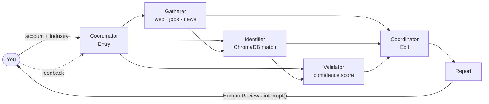

# Enterprise Account Business Development System

> This tool helps a Head of Sales at a Tier-1 Tech firm reduce account research time from 4 hours to 4 minutes.

A full-stack multi-agent AI system that automates enterprise sales research. Given a target account, it gathers intelligence in real time, identifies sales opportunities, and generates actionable reports.

**Stack:** LangGraph · FastAPI · React/TypeScript · ChromaDB · LangSmith

---

## The Problem

Enterprise sales teams spend 5-10 hours per account researching prospects: scanning job postings for technology signals, reading news for expansion plans, and manually matching customer needs to products. This work is repetitive, time-consuming, and inconsistent.

## The Solution

A multi-agent system that:
1. **Gathers intelligence** from web searches, job postings, and news
2. **Extracts requirements** using LLM-powered analysis
3. **Matches products** via semantic search against your product catalog
4. **Validates opportunities** with confidence scoring and risk assessment
5. **Generates reports** with actionable sales recommendations

Delivered through a real-time web interface that streams live agent progress.

**Result:** Validated opportunities identified from signals for the target customer in a single automated run.

---

## Architecture

The frontend streams real-time agent progress via Server-Sent Events. Clicking any completed node opens an observability panel showing run time, extracted data, and a LangSmith trace deep-link.

### Agent Workflow



The workflow pauses after report generation using LangGraph's `interrupt()` primitive. The user reviews the report in the browser and submits feedback (approve / dig deeper / different products / custom). The workflow resumes from the SQLite checkpoint with the feedback injected.

### Seller-Agnostic Design

Works with any company's product catalog. Index once, research unlimited accounts:

```bash
# Index your product catalog (JSON, URL, or markdown)
python -m src.cli setup-catalog --seller "YourCompany" --catalog-file products.json

# Research a target account
python -m src.cli research "Boeing" --industry aerospace --seller "YourCompany"
```

---

## Key Features

| Feature | Implementation |
|---------|----------------|
| **Multi-Agent Orchestration** | LangGraph with conditional routing and checkpointed feedback loops |
| **Real-Time Streaming** | Server-Sent Events stream node state (started / completed / waiting) to the frontend live |
| **Human-in-the-Loop** | LangGraph `interrupt()` pauses the workflow; resumes from SQLite checkpoint on feedback |
| **Agent Observability** | Click any node to inspect run time, extracted data, and LangSmith trace link |
| **Semantic Product Matching** | ChromaDB + sentence-transformers for embedding-based opportunity identification |
| **Intelligent LLM Routing** | 3-tier routing (local Ollama → Groq API) based on task complexity |
| **Session Persistence** | Pause, stop, and resume research sessions across browser reloads via SQLite |
| **Production-Ready** | 454 tests passing, structured logging (structlog), Pydantic v2 validation |

---

## Production-Grade Engineering

### State Persistence — No Lost Work

For an enterprise customer like Disney, a system that crashes and loses progress is unusable. Every node completion is checkpointed to SQLite. If the agent fails mid-run, or the user closes the browser, the workflow resumes from exactly where it paused:

```python
# src/graph/workflow.py
conn = sqlite3.connect("data/checkpoints/checkpoints.db", check_same_thread=False)
self.app = self.graph.compile(
    checkpointer=SqliteSaver(conn),
    interrupt_before=["_wait_for_human"]  # pause for human review
)

# Resume from checkpoint — human can edit state before continuing
self.app.update_state(config, {"human_feedback": [user_input]})
result = self.app.invoke(None, config)  # None = resume from checkpoint
```

### Error Handling — Graceful Degradation

What happens when a search returns 0 results, or the LLM API rate limits? The workflow continues. Every external call uses `tenacity` retry with exponential backoff, and every data source falls back to a simpler strategy before returning an empty result:

```python
# src/data_sources/mcp_ddg_client.py
@retry(stop=stop_after_attempt(3), wait=wait_exponential(min=2, max=10),
       retry=retry_if_exception_type(DataSourceTimeoutError))
async def search(self, query: str) -> list[SearchResult]: ...

# If "Boeing AI hiring news" returns nothing, try simpler queries before giving up
for query_variant in [f"{query} news", f"{query} announcement", query]:
    results = await self.search(query_variant)
    if results:
        return results
return []  # Workflow continues with partial data rather than crashing
```

### Response Caching — Cost-Conscious by Design

**Application-level caching** (all providers): Identical LLM prompts return cached results — ~0ms, $0 cost.
Search results are cached separately with a shorter TTL:

```python
# src/core/model_router.py — 24-hour TTL for LLM responses
cached = self.cache.get(model, prompt, temperature=temperature)
if cached:
    return cached  # Cache hit: instant response, zero API cost
self.cache.set(model, prompt, response)

# src/data_sources/mcp_ddg_client.py — 1-hour TTL for search results
cached = self.cache.get("search", query=query, max_results=max_results)
if cached is not None:
    return cached
```

**Anthropic prompt caching** (`cache_control`): Sales agents reuse the same system prompts
(product catalog, analysis playbook) across dozens of calls per session. Marking them with
`cache_control` caches them on Anthropic's servers — ~90% cost reduction on those tokens:

```python
# src/core/model_router.py — _call_anthropic_model()
# The system prompt (product catalog + instructions) is identical across many calls.
# Only the user prompt (account-specific query) changes each time.
messages = [
    {
        "role": "system",
        "content": [{
            "type": "text",
            "text": system_prompt,            # product catalog + analysis instructions
            "cache_control": {"type": "ephemeral"}   # cached on Anthropic's servers
        }]
    },
    {"role": "user", "content": prompt}       # account-specific query (not cached)
]
response = await litellm.acompletion(model="anthropic/claude-haiku-4-5-20251001", messages=messages)
```

---

## Quick Start

**Backend:**
```bash
git clone https://github.com/MahaveerSatra/SalesStrategy_AgentTeam.git
cd SalesStrategy_AgentTeam
python -m venv venv && source venv/bin/activate  # .\venv\Scripts\Activate.ps1 on Windows
pip install -r requirements.txt
cp .env.example .env  # Add GROQ_API_KEY (free at console.groq.com)

uvicorn api.main:app --reload --port 8000
```

**Frontend:**
```bash
cd frontend
npm install && npm run dev
# → http://localhost:5173
```

**CLI (no UI required):**
```bash
python -m src.cli research "Remora Carbon" --industry "carbon capture" --seller "MathWorks"
```

---

## Technology Stack

| Layer | Technologies |
|-------|-------------|
| **Orchestration** | LangGraph, SQLite checkpointing, `interrupt()` for human-in-the-loop |
| **API Layer** | FastAPI, Server-Sent Events, asyncio |
| **Frontend** | React 18, TypeScript, ReactFlow, TanStack Query, Tailwind CSS, recharts |
| **LLMs** | Ollama (local), Groq API, LiteLLM routing |
| **Vector Search** | ChromaDB, sentence-transformers |
| **Data Sources** | DuckDuckGo MCP, BeautifulSoup, httpx |
| **Observability** | LangSmith tracing, in-app SSE callback handler, per-node trace store |
| **Resilience** | tenacity retry, TTL caching (24h LLM / 1h search), graceful degradation |
| **Validation** | Pydantic v2, structured LLM outputs |
| **Testing** | pytest, 454 tests, 100% pass rate |

---

## Project Structure

```
src/                              # Backend agents
├── agents/                       # Coordinator, Gatherer, Identifier, Validator
├── graph/                        # LangGraph workflow + SSECallbackHandler
├── data_sources/                 # MCP client, job scrapers, product catalog
└── models/                       # Pydantic schemas, ResearchState

api/                              # FastAPI layer
├── routers/research.py           # REST + SSE endpoints
├── services/workflow_service.py  # Agent lifecycle (start/pause/resume/discard)
└── sse/event_stream.py           # Per-thread asyncio queues for SSE

frontend/src/                     # React SPA
├── components/                   # WorkflowGraph, NodeTracePanel, ReportView, ResearchForm
├── hooks/                        # useSSEStream (EventSource), useResearchWorkflow (TanStack Query)
└── lib/api.ts                    # Typed fetch wrappers for all API endpoints
```

**454 tests passing**

---

## Evals

Custom eval framework for measuring and improving agent output quality across prompt iterations.

**Design**: Model-graded evaluation using Claude as judge (CoT reasoning → structured JSON) plus 9 deterministic rule-based checks. Results are tracked in `history.csv` to show score deltas after prompt changes.

**4 Metrics (1–5 scale):**
- **Accuracy** — Are talking points grounded in evidence with citations ([SIG-001], [JOB-002])?
- **Actionability** — Does the report give a sales rep concrete next steps and specific personas?
- **Alignment** — Do recommended products genuinely fit the account's industry signals?
- **Safety & Ethics** — Is the output consultative and honest, with no manipulative pressure tactics?

### Running Evals

```bash
# Fast smoke test — synthetic state, no live API or Ollama required
python -m evals.run_evals --case TC-01 --mock

# Live run (requires Ollama running) — Remora Carbon is most reliable
python -m evals.run_evals --case TC-04

# Manual judge step: paste evals/results/pending_judge_TC-04.txt into Claude Pro
# Save the JSON response to: evals/results/judge_response_TC-04.json

# Record scores
python -m evals.run_evals --ingest TC-04

# Track improvement across runs
python -m evals.run_evals --compare
```

### Score History

| Run | Case | Accuracy | Actionability | Alignment | Safety | Overall | Det |
|-----|------|----------|---------------|-----------|--------|---------|-----|
| — | — | — | — | — | — | — | — |

*Score history will populate after running `--ingest` on completed eval cases.*

---

## License

MIT License

---

**Built by:** Mahaveer Satra
**Contact:** [LinkedIn](https://www.linkedin.com/in/mahaveer-satra/)
