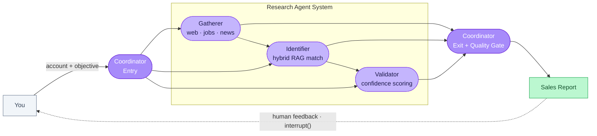

# Enterprise Account Business Development System

> Reduces account research time from 4 hours to 4 minutes for enterprise sales teams.

A full-stack multi-agent AI system that automates enterprise sales research. Given a target account, it gathers intelligence in real time, identifies sales opportunities, and generates actionable reports.

**Stack:** LangGraph · FastAPI · React/TypeScript · ChromaDB · LangSmith

---

## The Problem

Before every customer meeting, an Account Executive manually scans job postings for technology signals, reads recent news for expansion plans, and maps customer needs to products. For an enterprise account, that's 4–5 hours of repetitive, inconsistent work — done every single time.

The problem isn't effort. It's that this process doesn't scale, and its quality depends entirely on who's doing it.

## The Solution

A team of AI agents that handles the research end-to-end:

1. **Gathers intelligence** — web, news, and job board signals for the target account
2. **Extracts requirements** — identifies what the customer actually needs from what they're hiring for and saying publicly
3. **Matches products** — finds the right recommendations via a 3-stage hybrid RAG pipeline
4. **Validates opportunities** — scores confidence, flags risks, filters out weak matches
5. **Generates a cited report** — every claim traceable to a source signal, ready for the AE to walk into the meeting

Delivered through a real-time browser UI that streams live agent progress, or a single CLI command with no UI required.

---

## Architecture

### Agent Workflow



The workflow pauses after report generation using LangGraph's `interrupt()` primitive. The AE reviews the report in the browser and submits feedback — the workflow resumes from the SQLite checkpoint with feedback injected. Works with any company's product catalog: drop in a seller taxonomy JSON and the system adapts with no product names hardcoded in agent code.

### Two Ways to Run It

**Web UI** — Real-time streaming interface. Watch agents execute live, click any completed node to inspect extracted signals, opportunities, or risks, and submit feedback to loop back.

**CLI** — No UI required. Same agent orchestration, terminal output:
```bash
python -m src.cli research "Remora Carbon" --industry "carbon capture" --seller "MathWorks"
```

---

## What Makes This Hard — and How It's Built

**Account research takes 4–5 hours. This cuts it to 4 minutes.**
- An AE has to manually gather, read, and synthesize signals across job boards, news, and company pages before they can even form a hypothesis about what a customer needs
- Four specialized agents run this pipeline automatically — Gatherer collects raw signals, Identifier maps them to product opportunities, Validator re-scores with risk assessment, and Coordinator assembles the final report. Each step is observable: click any node in the browser to inspect run time and what was extracted

**AI recommends the wrong products without business context**
- A system that recommends existing products for an expansion deal, or niche products where broad capabilities are needed, destroys AE trust immediately
- The Validator parses sales intent (expansion / renewal / acquisition) from the stated objective and applies scoring rules specific to that scenario. A seller taxonomy JSON maps requirement types to primary products. Products outside the stated capability domain receive a −0.30 confidence penalty before surfacing in the report

**LLM output isn't grounded — claims can't be verified in a customer meeting**
- Unverified talking points are a liability. An AE needs to know exactly which signal supports which claim before they walk into the room
- Every signal collected is tagged (`[SIG-001]`, `[JOB-002]`). The LLM is required to cite evidence in every talking point. Nine deterministic checks run post-generation — if a cited signal doesn't exist in the collected data, the check fails and the output is flagged

**Generic output: every product cites the same evidence**
- Boilerplate talking points (three products all referencing the same Kubernetes job posting) signal low-quality output immediately to any experienced AE
- Signal uniqueness rules require each opportunity to build its own evidence story with distinct citations. Shared signals across products are rejected during generation

**Prompts degrade silently — you don't know until output quality drops**
- Without measurement, every prompt change is a guess. It's easy to improve one thing and break another without noticing
- A custom eval framework grades every run across accuracy, actionability, alignment, and safety (1–5 scale) using Claude as judge, plus 9 deterministic rule checks. Score history in a CSV shows the delta across prompt iterations — you see whether a change helped or hurt, and where

**Inference cost compounds at scale**
- Running a frontier model for every sub-task adds up fast — especially for tasks that don't need frontier reasoning
- Three-tier LLM routing dispatches by complexity: entry validation goes to local Ollama (instant, $0); analysis goes to Groq 8B; quality assessment goes to Groq 20B. Anthropic prompt caching marks the product catalog and analysis playbooks with `cache_control` — cached server-side, ~90% cost reduction on repeated lookups across a session

**Semantic search misses domain-specific terminology**
- "GNC toolboxes" doesn't semantically match "Sensor Fusion and Tracking Toolbox" without domain context. A naive vector search returns wrong products, and the LLM has nothing good to reason over
- A 3-stage retrieval pipeline: BM25 keyword + ChromaDB vector search merged via Reciprocal Rank Fusion → cross-encoder re-ranking (`ms-marco-MiniLM-L-12-v2`) on the top 30 → top 15 candidates passed to the LLM. The corpus includes 76 scraped solution pages (fetched via Tavily Extract API, which bypasses Cloudflare WAF) to bridge the gap between industry language and product names

---

## Production-Grade Engineering

### State Persistence — No Lost Work

Every node completion is checkpointed to SQLite. If the agent fails mid-run or the user closes the browser, the workflow resumes from exactly where it paused. Human feedback is injected into state before resuming — the agents continue as if the pause never happened.

### Error Handling — Graceful Degradation

Every external call uses tenacity retry with exponential backoff (3 attempts, 2–10s wait). Zero search results triggers simpler query variants before returning empty. Zero job postings continues with web signals only. The workflow completes with partial data rather than crashing — partial coverage beats a failed run during an enterprise demo.

### Response Caching — Cost-Conscious by Design

Application-level caching (24h TTL) covers all LLM providers — identical prompts return instantly at zero API cost. Search results cache with a 1-hour TTL. For Anthropic models, the product catalog and analysis playbooks are marked with `cache_control`, caching them server-side across dozens of calls per session — roughly 90% cost reduction on those repeated tokens.

### Observability — Know What Every Agent Did

Clicking any completed node in the browser opens a trace panel showing run time, what was extracted (signals, opportunities, risks), and a LangSmith deep-link to the full LLM call trace. Every agent uses structured logging via structlog. Every LLM call is traced through LangSmith automatically via LiteLLM.

---

## Quick Start

**Backend:**
```bash
git clone https://github.com/MahaveerSatra/SalesStrategy_AgentTeam.git
cd SalesStrategy_AgentTeam
python -m venv venv && source venv/bin/activate  # .\venv\Scripts\Activate.ps1 on Windows
pip install -r requirements.txt
cp .env.example .env  # Add GROQ_API_KEY (free at console.groq.com)

uvicorn api.main:app --reload --port 8000
```

**Frontend:**
```bash
cd frontend
npm install && npm run dev
# → http://localhost:5173
```

**CLI (no UI required):**
```bash
python -m src.cli research "Remora Carbon" --industry "carbon capture" --seller "MathWorks"
```

---

## Technology Stack

| Layer | Technologies |
|-------|-------------|
| **Orchestration** | LangGraph, SQLite checkpointing, `interrupt()` for human-in-the-loop |
| **API Layer** | FastAPI, Server-Sent Events, asyncio |
| **Frontend** | React, TypeScript, ReactFlow, TanStack Query, Tailwind CSS, recharts |
| **LLMs** | Ollama (local), Groq API, LiteLLM routing, Anthropic prompt caching |
| **Hybrid RAG** | ChromaDB (vector), rank-bm25 (BM25), sentence-transformers CrossEncoder (re-ranking) |
| **Data Sources** | DuckDuckGo MCP, Tavily (search + Extract API), BeautifulSoup, httpx |
| **Observability** | LangSmith tracing, in-app SSE callback handler, per-node trace store |
| **Resilience** | tenacity retry, TTL caching (24h LLM / 1h search), graceful degradation |
| **Validation** | Pydantic v2, structured LLM outputs |
| **Testing** | pytest, 454 tests, 100% pass rate |

---

## Project Structure

```
src/                              # Backend agents
├── agents/                       # Coordinator, Gatherer, Identifier, Validator
├── graph/                        # LangGraph workflow + SSECallbackHandler
├── data_sources/                 # MCP client, job scrapers, product catalog
└── models/                       # Pydantic schemas, ResearchState

api/                              # FastAPI layer
├── routers/research.py           # REST + SSE endpoints
├── services/workflow_service.py  # Agent lifecycle (start/pause/resume/discard)
└── sse/event_stream.py           # Per-thread asyncio queues for SSE

frontend/src/                     # React SPA
├── components/                   # WorkflowGraph, NodeTracePanel, ReportView, ResearchForm
├── hooks/                        # useSSEStream (EventSource), useResearchWorkflow     (TanStack Query)
└── lib/api.ts                    # Typed fetch wrappers for all API endpoints
```

**454 tests passing**

---

## Evals

Custom eval framework for measuring and improving agent output quality across prompt iterations.

**Design:** Model-graded evaluation using Claude as judge (CoT reasoning → structured JSON) plus 9 deterministic rule-based checks. Evaluations run across multiple ground-truth accounts to prevent overfitting to a single scenario. Results tracked in `history.csv` to surface score deltas after each prompt change.

**4 Metrics (1–5 scale):**
- **Accuracy** — Are talking points grounded in evidence with citations (`[SIG-001]`, `[JOB-002]`)?
- **Actionability** — Does the report give an AE concrete next steps and specific personas?
- **Alignment** — Do recommended products genuinely fit the account's industry signals?
- **Safety & Ethics** — Is the output consultative and honest, with no manipulative pressure tactics?

### Running Evals

```bash
# Fast smoke test — synthetic state, no live API or Ollama required
python -m evals.run_evals --case TC-01 --mock

# Live run (requires Ollama running)
python -m evals.run_evals --case TC-04

# Manual judge step: paste evals/results/pending_judge_TC-04.txt into Claude Pro
# Save the JSON response to: evals/results/judge_response_TC-04.json

# Record scores
python -m evals.run_evals --ingest TC-04

# Track improvement across runs
python -m evals.run_evals --compare
```

### Score History

Evaluated across multiple accounts (TC-02 NASA expansion, TC-04 Remora Carbon startup) to prevent overfitting.

| Phase | Accuracy | Actionability | Alignment | Safety | Overall | Change |
|-------|----------|---------------|-----------|--------|---------|--------|
| Baseline | 4/5 | 2/5 | 1/5 | 5/5 | 3.0 | — |
| Phase 1 | 4/5 | 3/5 | 2/5 | 5/5 | 3.5 | +0.5 — intent parsing, risk mitigations |
| Phase 2 | 5/5 | 4/5 | 3/5 | 5/5 | 4.2 | +0.7 — hybrid RAG corpus enrichment, free-form query generation |
| Phase 3 | 3/5 | 4/5 | 4/5 | 5/5 | 4.0 | Alignment +1, Accuracy regression on sparse-data account — seller taxonomy injection, auto-reroute quality gate |

**Per-agent detail (TC-02 NASA):**

| Agent | Baseline | Phase 1 | Delta | Phase 2 changes |
|-------|----------|---------|-------|-----------------|
| Gatherer | 3.0 | 3.5 | +0.5 | Free-form queries; source-authority scoring; Groq 8B |
| Identifier | 2.75 | 3.0 | +0.25 | 5–7 opportunities; abbreviation expansion; top_k=15 |
| Validator | 2.25 | 3.25 | +1.0 | Intent parsing; risk mitigations; coverage check |
| Coordinator | 2.75 | 3.5 | +0.75 | Inherited from upstream improvements |

**What each phase fixed:**

- **Phase 1** — Validator scored existing products (MATLAB) as "aligned" for an expansion objective. Fixed: intent parsing now applies a mandatory −0.25 penalty on confirmed existing products. All risks now require paired mitigation strategies.
- **Phase 2** — Catalog descriptions were one-sentence stubs, preventing BM25 from matching "GNC toolboxes" → "Sensor Fusion and Tracking Toolbox". Fixed: 133 product pages scraped (347 total docs), vector search weighted 1.5× over BM25, LLM expands domain abbreviations before retrieval.
- **Phase 3** — Identifier selected Navigation Toolbox over Sensor Fusion for a GNC requirement (keyword match on "Navigation"). Fixed: seller taxonomy JSON injected into Identifier and Validator prompts, coordinator auto-quality-gate reroutes when coverage gaps detected.

---

## License

MIT License

---

**Built by:** Mahaveer Satra
**Contact:** [LinkedIn](https://www.linkedin.com/in/mahaveer-satra/)
